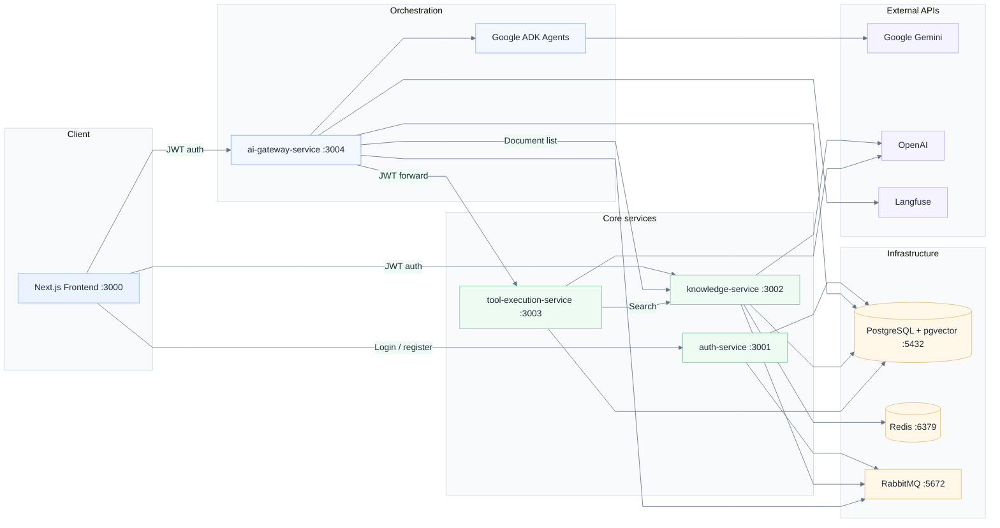

# AI Assistant

A production-oriented **RAG chat platform** with **multi-agent orchestration** and **tool execution**. Users upload documents, ask questions in natural language, and receive answers grounded in their knowledge base — with optional structured data queries via a read-only SQL tool.

The system is built as **microservices** (Express + Prisma + PostgreSQL) with a **Next.js** frontend, **Google ADK** agents in the gateway, and **OpenAI** for embeddings / NL→SQL / metadata extraction.

---

## Table of contents

1. [Architecture](#architecture)
2. [Agent orchestration](#agent-orchestration)
3. [Services](#services)
4. [Tools](#tools)
5. [Authentication & authorization](#authentication--authorization)
6. [Security](#security)
7. [Knowledge retrieval (RAG)](#knowledge-retrieval-rag)
8. [SQL tool & schema scaling](#sql-tool--schema-scaling)
9. [Model selection, cost & tradeoffs](#model-selection-cost--tradeoffs)
10. [Logging & LLM monitoring (Langfuse)](#logging--llm-monitoring-langfuse)
11. [User feedback (thumbs up / down)](#user-feedback-thumbs-up--down)
12. [Quick start](#quick-start)
13. [CI/CD](#cicd)
14. [Configuration](#configuration)
15. [Future work (recommended order)](#future-work-recommended-order)
16. [Related docs](#related-docs)

---

## Architecture

Five application services share one PostgreSQL database (with **pgvector**), plus **Redis** (embedding cache) and **RabbitMQ** (async jobs).



### Data & messaging flows

| Flow | Mechanism | Purpose |
|------|-----------|---------|
| Document upload | HTTP → RabbitMQ `document.uploaded` | Async chunking, metadata, embedding |
| Chat message | HTTP → RabbitMQ `chat.requested` → worker | Non-blocking agent pipeline; UI polls `GET /agent-runs/:id` |
| User registration | RabbitMQ `user.registered` | Event hook for downstream consumers |
| Tool execution | Gateway → HTTP `POST /tools/execute` | Centralized audit + validation |

### Database ownership (logical)

| Schema / tables | Owner service |
|-----------------|---------------|
| `auth_users`, `auth_refresh_tokens` | auth-service |
| `knowledge_documents`, `knowledge_document_chunks` | knowledge-service |
| `gateway_conversations`, `gateway_messages`, `gateway_agent_runs`, `gateway_todos` | ai-gateway-service |
| `tool_executions` | tool-execution-service |

All services connect to the same Postgres instance in development; in production you would typically split schemas or databases per service.

---

## Agent orchestration

The **ai-gateway-service** runs a **Google ADK** multi-step workflow. The flow below shows the agent pipeline and service interactions.

```mermaid
%%{init: {'theme':'base','flowchart': {'curve':'linear'}, 'themeVariables': {'fontFamily':'Inter, Arial, sans-serif','lineColor':'#64748b','clusterBkg':'#f8fafc','clusterBorder':'#cbd5e1'}}}%%
flowchart LR
  UI[Frontend UI]
  AUTH[auth-service]
  API[ai-gateway-service API]
  RMQ[(RabbitMQ chat queue)]

  subgraph agents [Gateway Agent Flow]
    QR[QueryRewriterAgent]
    PA[PlanAgent]
    TE[TodoExecutorAgent]
    SA[SynthesisAgent]
    JUDGE[Answer Judge]
  end

  TS[tool-execution-service]
  KS[knowledge-service]
  DB[(PostgreSQL)]

  UI -->|Login / token refresh| AUTH
  UI -->|POST message + JWT| API
  API -->|Queue job| RMQ
  RMQ -->|Worker consumes| QR
  QR --> PA
  PA --> TE
  TE -->|knowledge_retrieval / sql / calculator| TS
  TS -->|RAG search| KS
  KS --> DB
  TS --> DB
  TE --> SA
  SA --> JUDGE
  JUDGE -->|Final response| API
  API -->|AgentRun status + answer| UI

  classDef uiNode fill:#e6f4ff,stroke:#7db0dd,color:#1f2937;
  classDef authNode fill:#fff3e6,stroke:#e2b37a,color:#1f2937;
  classDef gatewayNode fill:#edf2ff,stroke:#8ea2e6,color:#1f2937;
  classDef agentNode fill:#f0ecff,stroke:#a595e6,color:#1f2937;
  classDef serviceNode fill:#e9fcef,stroke:#7dc99b,color:#1f2937;
  classDef storageNode fill:#fffbe8,stroke:#d6c873,color:#1f2937;

  class UI uiNode;
  class AUTH authNode;
  class API,RMQ gatewayNode;
  class QR,PA,TE,SA,JUDGE agentNode;
  class TS,KS serviceNode;
  class DB storageNode;
```



### Agents

| Agent | Model (default) | Role |
|-------|-----------------|------|
| **QueryRewriterAgent** | `gemini-3.1-flash-lite` | Turns follow-up messages into standalone queries; maintains rolling `historySummary` |
| **PlanAgent** | `gemini-3.1-flash-lite` | Produces structured plan + todo list with optional `toolHint` |
| **TodoExecutorAgent** | `gemini-3.1-flash-lite` | Runs todos, calls remote tools, updates todo status in DB |
| **SynthesisAgent** | `gemini-3.1-flash-lite` | Writes user-facing answer from plan + execution results |
| **Answer judge** (callback) | `gemini-3.1-flash-lite` | Scores synthesis for correct / partial / wrong before delivery |

Workflow definition: `services/ai-gateway-service/src/agents/workflow.agent.ts`

Orchestration logic: `services/ai-gateway-service/src/services/agent-orchestrator.service.ts`

Structured outputs use Gemini `Schema` in `services/ai-gateway-service/src/agents/output-schemas.ts`.

Prompts are centralized per service — see [Prompts](#prompts).

---

## Services

| Service | Port | Stack | Responsibility |
|---------|------|-------|----------------|
| [frontend](services/frontend) | 3000 | Next.js 16, React 19, Zustand | Login, chat UI, knowledge upload, agent-run polling, thumbs feedback |
| [auth-service](services/auth-service) | 3001 | Express, JWT, bcrypt | Register, login, refresh tokens |
| [knowledge-service](services/knowledge-service) | 3002 | Express, pgvector, OpenAI | Upload, chunk, embed, metadata-enriched search |
| [tool-execution-service](services/tool-execution-service) | 3003 | Express, mathjs, AI SDK | Calculator, NL→SQL, knowledge retrieval proxy |
| [ai-gateway-service](services/ai-gateway-service) | 3004 | Express, Google ADK, Langfuse | Chat, agent workflow, conversation memory |

### Infrastructure (Docker)

| Component | Image | Port |
|-----------|-------|------|
| PostgreSQL + pgvector | `pgvector/pgvector:pg15` | 5432 |
| Redis | `redis:7-alpine` | 6379 |
| RabbitMQ | `rabbitmq:3.12-management` | 5672 (AMQP), 15672 (UI) |

---

## Tools

Agents never call external APIs directly. The **TodoExecutorAgent** invokes tools defined in ADK; remote tools are proxied to **tool-execution-service** with the user's JWT.

| Tool | Input | Backend | Notes |
|------|-------|---------|-------|
| `knowledge_retrieval` | `query`, optional `limit`, `documentId`, `minSimilarity` | knowledge-service `/documents/search` | Metadata-filtered pgvector search |
| `sql_query` | `question` (natural language) | OpenAI SQL generator + Postgres | Agent cannot pass raw SQL |
| `calculator` | `expression` | mathjs (AST whitelist) | Safe numeric evaluation only |
| `update_todo_status` | `position`, `status`, `resultSummary` | gateway DB | Tracks plan progress for UI |

Tool definitions: `services/ai-gateway-service/src/agents/tools/remote-tools.ts`

Every tool execution is **audited** in `tool_executions` (input, output, duration, success/failure).

---

## Authentication & authorization

### Token model

- **Access token** (JWT, default 15m): sent as `Authorization: Bearer <token>` on every API call.
- **Refresh token** (JWT, default 7d): stored server-side in `auth_refresh_tokens`; rotated on refresh.
- Payload includes `sub` (user id), `email`, `role`.

### Where auth is enforced

| Service | Middleware | User scoping |
|---------|------------|--------------|
| auth-service | Public `/auth/*`; protected `/users/*` | N/A |
| knowledge-service | `authenticate` on all `/documents/*` | Documents filtered by `userId` |
| tool-execution-service | `authenticate` on all `/tools/*` | SQL + knowledge calls scoped to JWT user |
| ai-gateway-service | `authenticate` on all routes | Conversations and agent runs owned by `userId` |

The gateway **forwards the user's access token** to tool-execution-service so audit trails and knowledge queries stay user-scoped.

### Roles

Users have a `role` field (default `user`). The gateway exposes `requireRole()` middleware for admin-only routes when needed.

### Frontend

Access token is held in client state and attached to all API requests via `apiFetch`. On 401, the client should refresh or redirect to login.

---

## Security

Defense in depth across services:

### Transport & HTTP hardening

- **Helmet** on all Express services (security headers).
- **CORS** enabled (tighten origins in production).
- **express-rate-limit** on every service; gateway uses tiered limits (read / chat / write).
- Request body size limits (gateway 2 MB, tools 1 MB).

### Authentication secrets

- Separate `JWT_SECRET` and `REFRESH_TOKEN_SECRET`.
- Passwords hashed with **bcrypt** (`BCRYPT_ROUNDS`, default 10).
- Input validation with **Zod** on auth and tool payloads.

### SQL tool (highest risk surface)

1. **NL→SQL only** — agents pass a `question`, not SQL text.
2. **`validateReadOnlySql()`** runs twice: after generation and before execution.
3. Blocks: DML, DDL, multi-statement, comments, system catalogs, `FOR UPDATE`, `SELECT INTO`.
4. **Row cap** (`SQL_MAX_ROWS`, default 500) and **statement timeout** (`SQL_STATEMENT_TIMEOUT_MS`, default 5s).
5. **Schema allowlist** via `SQL_ALLOWED_SCHEMAS` (default `public`).
6. **Parameterized tenancy** — queries touching `knowledge_*` tables must use `user_id = $1`; the authenticated user's id is bound server-side at execution time (never embedded as a numeric literal in generated SQL). The validator rejects `user_id = 42`-style literals.
7. **Parameterized execution** — LLM-generated SQL runs via `$queryRawUnsafe(query, userId)` so `$1` is always the JWT user. Internal catalog/timeout queries use `Prisma.sql` or server-controlled literals (PostgreSQL does not accept bind params in `SET LOCAL`).
8. One automatic **repair retry** on validation/execution failure with error feedback (not full schema re-dump).

Implementation: `services/tool-execution-service/src/services/sql-validator.ts`

### Calculator tool

- Parses expression to AST; only whitelisted functions and constants (`pi`, `e`, `tau`).
- Rejects symbols, assignment, and arbitrary code execution.

### Knowledge uploads

- MIME allowlist: PDF, plain text, Markdown.
- Max file size: `MAX_UPLOAD_SIZE_MB` (default 10).
- In-memory storage during upload; source text cleared after indexing.

### Agent guardrails (ADK callbacks)

| Callback | When | Action |
|----------|------|--------|
| `beforeAgentGuard` | Before Plan / Executor / Synthesis | Reject empty input; cap message at 8 000 chars |
| `beforeToolGuard` | Before each tool call | Validate required args and length limits |
| `synthesisAfterModelJudge` | After synthesis LLM | LLM judge scores answer; optional block or warning |
| `synthesisAfterAgentLog` | After synthesis | Log judge result to Langfuse |

Env: `GUARDRAIL_JUDGE_ENABLED`, `GUARDRAIL_MIN_SCORE`, `GUARDRAIL_BLOCK_ON_FAIL`, `GUARDRAIL_APPEND_WARNING`.

### Async job security note

Chat jobs carry the user's JWT in the RabbitMQ payload for tool forwarding. In production, prefer **short-lived delegated tokens** or **service-side user context** instead of long-lived JWTs in queues.

---

## Knowledge retrieval (RAG)

Pipeline (see [docs/KNOWLEDGE_RETRIEVAL.md](docs/KNOWLEDGE_RETRIEVAL.md)):

1. **Ingestion** (async via RabbitMQ): extract text → chunk → LLM chunk metadata → embed (`text-embedding-3-small`) → store in pgvector (HNSW index).
2. **Search**: load user's metadata catalog → LLM picks filter values from catalog only → vector search with filters → fallback to unfiltered search if zero hits.
3. **Embedding cache** (Redis): skip re-embedding identical chunk text.

Agent receives a **knowledge catalog** (user's completed documents) in session state before planning.

---

## SQL tool & schema scaling

The agent can answer structured questions over Postgres via the `sql_query` tool. Schema metadata comes from `information_schema`, scoped by `SQL_ALLOWED_SCHEMAS`.

**Why not send the full schema every time?** Large schemas blow up prompts, increase cost, slow responses, and hurt accuracy.

| Database size | Strategy |
|-------------|----------|
| Small (&lt; ~25 agent-facing tables) | Curated table list + descriptions; column detail on demand |
| Medium | **Schema retrieval**: embed table/column docs, fetch top-K relevant tables per question |
| Large | **Semantic layer**: stable SQL views + glossary; agent sees views, not raw tables |

**Current implementation (Phase A):** full schema catalog to OpenAI `gpt-5.4-nano-2026-03-17` via AI SDK `generateObject`; validate → execute → optional repair retry.

Principles:

1. Generate SQL in the app layer, not inside Postgres extensions.
2. Retrieve schema context; don't dump it (same idea as document RAG).
3. On errors, retry with error message + small schema slice.

---

## Model selection, cost & tradeoffs

| Use case | Default model | Provider | Why this choice |
|----------|---------------|----------|-----------------|
| Agent planning, execution, synthesis, query rewrite, answer judge | `gemini-3.1-flash-lite` | Google Gemini | Latest lightweight Gemini; fast, low cost, strong tool-calling & structured JSON via ADK; single API key for the full agent loop |
| Document embeddings | `text-embedding-3-small` (1536d) | OpenAI | Cost-effective at scale; good retrieval quality; pgvector HNSW tuned for 1536 dims |
| Chunk / document metadata | `gpt-5.4-nano-2026-03-17` | OpenAI | Cheap structured extraction during ingestion |
| Query metadata filters (search) | `gpt-5.4-nano-2026-03-17` | OpenAI | Small JSON output; runs once per search |
| NL→SQL generation | `gpt-5.4-nano-2026-03-17` | OpenAI | Strong reasoning for SQL; AI SDK `generateObject` gives reliable schema-constrained output |

### Tradeoffs

| Decision | Benefit | Cost / risk |
|----------|---------|-------------|
| Gemini for agents | One stack (ADK native), fast iteration, lower $/1M tokens vs GPT-4 class | Two cloud vendors (Gemini + OpenAI); Gemini API availability tied to Google |
| OpenAI for SQL + embeddings | Best-in-class embedding model; SQL generation separated from agent loop | Extra API key; SQL path not traced in Langfuse today unless extended |
| Sequential agent workflow vs single ReAct loop | Predictable steps, easier debugging, clear todo UI | Higher latency (3+ LLM calls per message); no parallel tool execution |
| Async chat via RabbitMQ + polling | Simple scaling of workers; UI stays responsive | Not true token streaming; 2s poll interval adds perceived delay |
| Read-only SQL in app layer | Full control over validation, tenancy, audit | More code than DB extensions; schema must fit in context (Phase A limit) |
| LLM answer judge on every reply | Catches hallucinations / weak grounding | Extra Gemini call per message; may block good answers if threshold too high |

### Rough cost drivers (per chat turn)

1. Query rewrite — 1× Gemini call  
2. Plan — 1× Gemini call  
3. Executor — 1+ Gemini calls (depends on todos / tool rounds)  
4. Synthesis — 1× Gemini call  
5. Answer judge — 1× Gemini call  
6. Tools — 0–N × OpenAI (SQL) + embedding calls (search)

Optimize by: caching knowledge catalog, reducing todos for simple queries, routing simple questions to a lighter path (future work), and tuning `GUARDRAIL_JUDGE_ENABLED`.

---

## Logging & LLM monitoring (Langfuse)

### Application logging (all services)

- **Pino** structured JSON logs (`LOG_LEVEL`, default `info`).
- **pino-http** request logging on Express services.
- Key business events: user register/login, document ingestion, agent step errors, tool failures, guardrail judge outcomes.

Loggers: `services/*/src/utils/logger.ts`

### Langfuse (ai-gateway-service only)

When `LANGFUSE_PUBLIC_KEY` + `LANGFUSE_SECRET_KEY` are set and `LANGFUSE_ENABLED=true`, the gateway exports OpenTelemetry spans to Langfuse.

Setup: [services/ai-gateway-service/docs/LANGFUSE.md](services/ai-gateway-service/docs/LANGFUSE.md)

#### Trace hierarchy

| Observation | Description |
|-------------|-------------|
| `chat.agent-pipeline` | End-to-end: user message → assistant reply |
| `agent.query-rewrite` | Standalone query rewriter |
| `agent.workflow` | Plan → executor → synthesis |
| `agent.step.plan` / `.executor` / `.synthesis` | Step outputs (preview) |
| `tool.knowledge_retrieval` / `tool.sql` / `tool.calculator` | Remote tool spans |
| `guardrail.answer-judge` / `.result` | Judge input/output |
| `openai.chat-completions` | If using custom OpenAI LLM adapter |

Metadata: `userId`, `conversationId`, `agentRunId`, `service`, environment.

#### What is not in Langfuse yet

- knowledge-service embedding / metadata LLM calls  
- tool-execution-service SQL generator calls  
- Document ingestion pipeline  

Extend tracing there for full end-to-end cost and latency dashboards.

#### Recommended monitoring workflow

1. **Development** — Langfuse project per developer or shared `development` environment tag.  
2. **Staging** — Enable judge + trace sampling; add Langfuse **LLM-as-a-Judge** evaluators on sampled traces.  
3. **Production** — Alert on error spans, p95 `chat.agent-pipeline` latency, tool failure rate, judge `wrong` verdict rate.  
4. **Feedback loop** — Correlate stored thumbs-up/down ratings with Langfuse traces (see [User feedback](#user-feedback-thumbs-up--down); future: store `traceId` on message metadata).

---

## User feedback (thumbs up / down)

Users can rate each assistant reply with **thumbs up** or **thumbs down** directly in the chat UI. Ratings are persisted in the gateway database for future **prompt fine-tuning**, **quality monitoring**, and **eval datasets**.

### How it works

1. **Chat UI** — Each assistant message shows 👍 / 👎 controls (`MessageFeedback` component).
2. **Submit** — `POST /feedback` with `conversationId`, `assistantMessageId`, and `rating` (`up` | `down`).
3. **Storage** — `gateway_message_feedback` stores the paired **user query**, **assistant answer**, rating, and message IDs (one rating per user per assistant message; upsert on change).
4. **Admin view** — `/admin/feedback` lists all feedback for review and export.

### API

| Method | Path | Description |
|--------|------|-------------|
| `POST` | `/feedback` | Submit or update thumbs up/down on an assistant message |
| `GET` | `/feedback` | List feedback records (paginated; admin review) |

### Data captured (for future use)

Each feedback row includes:

| Field | Purpose |
|-------|---------|
| `userQuery` | Original question that led to the answer |
| `assistantAnswer` | Full assistant response that was rated |
| `rating` | `UP` or `DOWN` |
| `conversationId`, message IDs | Link back to full agent run / plan / tools in message metadata |

### Planned uses

- **Monitoring** — Track downvote rate over time; slice by conversation, user, or date in the admin UI.
- **Prompt iteration** — Build golden sets from highly-rated answers; inspect downvoted pairs to revise agent prompts.
- **Fine-tuning / eval** — Export `(userQuery, assistantAnswer, rating)` as training or eval data once volume is sufficient.
- **Langfuse correlation** — Join feedback with agent traces (planned: store `traceId` on assistant message metadata) to compare user satisfaction vs automated judge scores.

Implementation: `services/ai-gateway-service/src/services/feedback.service.ts`, `services/frontend/src/components/chat/message-feedback.tsx`.

---

## Quick start

### Prerequisites

- Node.js 20+
- Docker (Postgres, Redis, RabbitMQ)
- API keys: `GEMINI_API_KEY` (gateway), `OPENAI_API_KEY` (knowledge + tools)

### One-time setup

Copy each service `.env.example` → `.env` and fill in secrets:

```powershell
npm install
npm install --prefix services/auth-service
npm install --prefix services/knowledge-service
npm install --prefix services/tool-execution-service
npm install --prefix services/ai-gateway-service
npm install --prefix services/frontend
copy services\frontend\.env.local.example services\frontend\.env.local
```

Run Prisma migrations for each service that owns a schema, then (optional) seed demo data:

```powershell
cd scripts && npm install && npm run seed
```

Demo login: `demo@example.com` / `Demo123!`

### Start everything

```powershell
npm run dev
```

| Command | What it does |
|---------|----------------|
| `npm run dev` | Build all backends, then start infra + services |
| `npm start` | Start infra + services (no rebuild) |
| `npm run infra` | Docker only: db, redis, rabbitmq |

Open **http://localhost:3000**

### Manual service start (debugging)

```powershell
npm run infra
# In separate terminals:
npm start --prefix services/auth-service
npm start --prefix services/knowledge-service
npm start --prefix services/tool-execution-service
npm start --prefix services/ai-gateway-service
npm run dev --prefix services/frontend
```

---

## CI/CD

Single workflow: [`.github/workflows/ci.yml`](.github/workflows/ci.yml)

| Job | When | What it does |
|-----|------|----------------|
| **Test** | Every push / PR | Install deps, `prisma generate`, lint, migrate DB, run unit tests (no service `npm run build` — compilation happens in Docker) |
| **Semantic release** | Push to `main` only | `npm ci` at repo root (uses local `semantic-release` from `package.json`) → `npm run release` via semantic-release action |
| **Docker** | After tests pass | Multi-stage Dockerfile build + push on new semver release |

### Version tags

Docker images use **`{service}:{semver}`** from semantic-release:

```text
ghcr.io/<owner>/auth-service:1.2.0
ghcr.io/<owner>/knowledge-service:1.2.0
ghcr.io/<owner>/tool-execution-service:1.2.0
ghcr.io/<owner>/ai-gateway-service:1.2.0
ghcr.io/<owner>/frontend:1.2.0
```

PR builds verify Dockerfiles with `0.0.0-pr.<number>` tags (build only, no push).

Use [Conventional Commits](https://www.conventionalcommits.org/) on `main` so semantic-release can version:

| Commit | Release |
|--------|---------|
| `fix: ...` | Patch |
| `feat: ...` | Minor |
| `feat!: ...` / `BREAKING CHANGE:` | Major |

Config: [`.releaserc.json`](.releaserc.json) · local CLI: `npm run release`

### Run tests locally (no shell scripts)

```powershell
npm run infra
npm run build:shared
npm run build --prefix services/auth-service
# ... other services, or npm run build:all
npm run migrate:all
npm run test:all
```

### Dockerfiles

All service Dockerfiles use multi-stage builds: **shared-builder → deps → builder → runner** (frontend: **deps → builder → runner**). Production stages run as non-root `nodejs` user.

---

## Configuration

### Prompts

| Service | File |
|---------|------|
| ai-gateway-service | `services/ai-gateway-service/src/prompts/index.ts` |
| knowledge-service | `services/knowledge-service/src/prompts/index.ts` |
| tool-execution-service | `services/tool-execution-service/src/prompts/index.ts` |

### Key environment variables

| Variable | Service | Purpose |
|----------|---------|---------|
| `JWT_SECRET` | auth, gateway, knowledge, tools | Must match across services |
| `GEMINI_API_KEY` | gateway | ADK agents + answer judge |
| `GEMINI_MODEL` | gateway | Default `gemini-3.1-flash-lite` (all ADK agents + judge) |
| `OPENAI_API_KEY` | knowledge, tools | Embeddings, metadata, SQL |
| `LANGFUSE_*` | gateway | LLM tracing |
| `RATE_LIMIT_*` | gateway | Abuse protection |
| `SQL_*` | tools | SQL safety limits |
| `METADATA_QUERY_*` | knowledge | RAG filter extraction |
| `REDIS_URL` | knowledge | Embedding cache |

See each service's `.env.example` for the full list.

---

## Future work (recommended order)

Work in this sequence to maximize value and avoid rework:

### Phase 1 — Production readiness (do first)

1. **Secrets & config** — managed secrets (not `.env` in prod), unique JWT secrets, restrict CORS to frontend origin.
2. **Internal service auth** — replace JWT-in-RabbitMQ with service tokens or user-id + signed job context.
3. ~~**Database migrations CI**~~ — done in `.github/workflows/ci.yml` (test job).
4. **Health checks & graceful shutdown** — drain RabbitMQ consumers, flush Langfuse on SIGTERM (partially done).
5. **Horizontally scale gateway workers** — multiple consumers on `GATEWAY_AGENT_QUEUE` with prefetch=1 (already set).

### Phase 2 — Observability completeness

6. **Langfuse in tool-execution + knowledge** — trace SQL generation, embeddings, metadata extraction for true cost per query.
7. **Store `traceId` on messages** — link UI feedback to Langfuse traces.
8. **Dashboards** — p95 latency, tokens/cost per conversation, tool error rate, judge verdict distribution.
9. **Alerting** — pipeline failures, RabbitMQ queue depth, ingestion backlog.

### Phase 3 — UX & latency

10. **SSE or WebSocket streaming** — stream synthesis tokens instead of 2s polling (frontend hook: `use-streaming-chat.ts`).
11. **Fast path router** — skip full plan/execute for simple FAQ-style questions (single RAG call).
12. **Conversation title generation** — auto-title from first message.

### Phase 4 — RAG & SQL scale

13. **Schema retrieval (Phase B)** — embed table/column descriptions; retrieve top-K schema per SQL question.
14. **Semantic layer (Phase C)** — curated views for large or multi-tenant analytics schemas.
15. **Hybrid search** — BM25 + vector for knowledge chunks.
16. **Re-ranking** — cross-encoder or LLM rerank on top-K chunks before synthesis.

### Phase 5 — Agent quality & safety

17. **Stronger tenancy** — Postgres RLS for knowledge tables; per-tenant schema routing for SQL.
18. **Tool allowlists per role** — e.g. SQL only for `analyst` role.
19. **Offline eval suite** — golden questions + Langfuse datasets; regression on plan quality and SQL accuracy.
20. **Human-in-the-loop** — escalate low judge scores to review queue.

### Phase 6 — Platform features

21. **Multi-modal documents** — images, DOCX, HTML extraction.
22. **Shared team knowledge bases** — org-level documents with ACLs.
23. **Plugin / MCP tool registry** — register third-party tools without redeploying gateway.
24. **Multi-region deployment** — read replicas, vector index partitioning by tenant.

---

## Related docs

- [Knowledge retrieval pipeline](docs/KNOWLEDGE_RETRIEVAL.md)
- [Langfuse setup (gateway)](services/ai-gateway-service/docs/LANGFUSE.md)
- [Frontend README](services/frontend/README.md)

---

## License

ISC (per service `package.json`).
